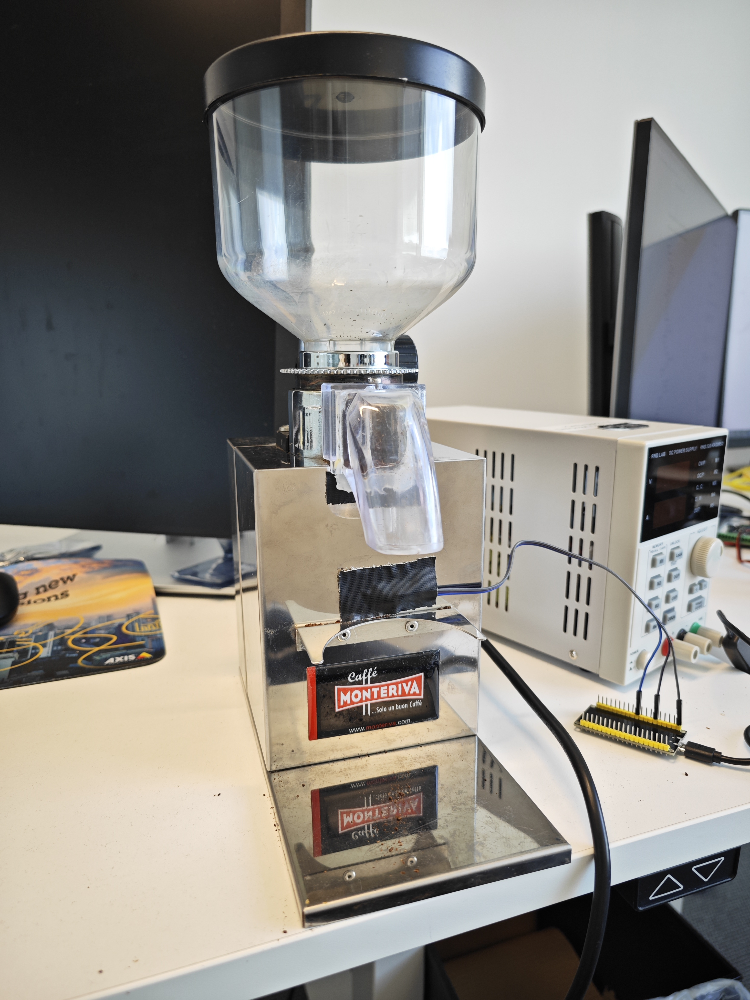

# Smart grinder by Alex and Xavou OG

How to automate a simple task.
This IOT project aim to create a smart controlled Coffee Bean Grinder.

## Description

C++ Project to use Dual Core of the ESP32 to control a relay wired to a motor and handle command from a Telegram Bot thanks to tasks.

## Architecture

A dual core architecture has been choose to allow a smooth and constant performance in all the task in the ESP32.

- The first task handle the telegram API interface and process the user input.
  The processed data is the added to the queue used by the second task.

- The second task handle the grinder motor handling with following the 'status' and the 'timer' variables.
  The task handle the timer and ensure the communication with the motor.

## Pipeline

- The Wifi Hotspot is created and a website at `192.168.4.1` (check your esp ip addr) allow the users to enter their wifi credential and save it in ESP32 nvs.
  While the Wifi's credentials doesn't change, the grinder auto-connects for a simple use.
  The grinder won't start since the Wifi isn't connected.
- The two task run in parallel sending data to from the communication task to the Grinder task.

## Librairies

- Arduino
- C++
- NVS
- FreeRTOS
- WifiServer - WifiSecureServer
- UniversalTelegramBot

## Installation

As Arduino doesn't detect directory in the main directory, all the `libraries` directories must be copied to your Arduino IDE libraries folders.
While compiling, if the header files are missing, the libraries are misplaced.

## Circuit Notes

- Relay with Octocoupler that handle 10A.
